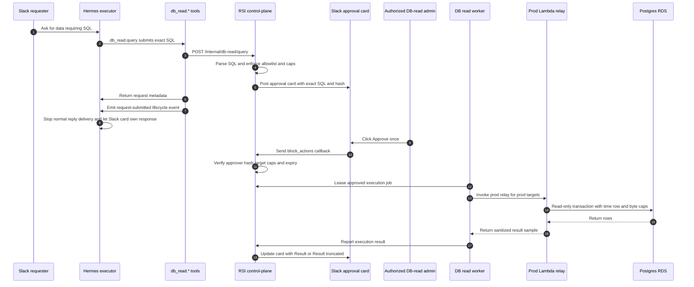
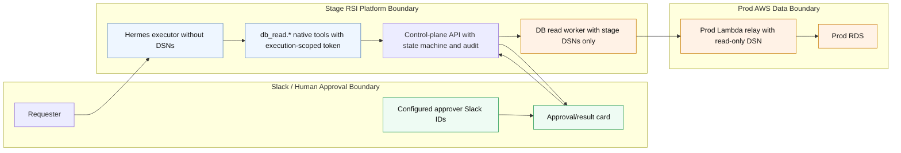

# RSI DB Read Gateway Architecture

This document describes the Slack-approved, read-only Postgres gateway used by RSI/Hermes for production and stage database reads.

The design goal is to let Hermes answer operational data questions without giving the Hermes executor pod direct database credentials. Hermes can submit a request, but RSI control-plane owns validation, approval, execution, audit, result rendering, and Slack response ownership.

## Components

- **Hermes executor pod**: runs the model and native tools. It has native `db_read.*` tools with an execution-scoped DB-read token. It does not have Postgres DSNs.
- **`db_read.*` native tools**: typed Hermes plugin tools registered by the RSI runtime. They submit validation/query/status requests and emit lifecycle events after query submission.
- **RSI control-plane API**: stores DB read requests, validation attempts, approvals, execution state, result samples, and audit metadata.
- **Slack surface**: posts and updates the approval/result card in the original Slack thread. Only configured approver Slack IDs can approve or deny.
- **DB read worker**: leases approved jobs from control-plane and performs validation/execution for stage targets. For prod targets, it invokes the prod Lambda relay.
- **Prod Lambda relay**: runs in the prod AWS network path and performs validation/execution against prod RDS using read-only DB credentials.
- **Postgres targets**: currently include `depin-stage`, `depin-prod`, and `rsi-platform-stage`.

## High-Level Flow



## Trust Boundaries



## Security Controls

- **No DB DSNs in Hermes**: the executor gets only native `db_read.*` tools and an execution-scoped control-plane token.
- **Exact SQL is approval-bound**: approval binds to target, SQL hash, successful validation attempt, requester, caps, and expiry.
- **Admin allowlist**: Slack button clicks are checked against `RSI_DB_READ_APPROVER_SLACK_USER_IDS`.
- **Read-only SQL validation**: the gateway accepts a single read-only `SELECT` or read-only `WITH`, rejects known unsafe SQL constructs, and validates against the target before execution.
- **Read-only execution**: DB reads run with per-target read-only users, read-only transaction/session settings, pinned `search_path`, `statement_timeout`, `lock_timeout`, row caps, and byte caps.
- **No SQL rewriting for caps**: the worker streams/fetches rows and stops when row or byte caps are reached.
- **Sanitized artifacts only**: Slack and stored result samples are sanitized/redacted by policy. Unredacted artifacts are out of scope.
- **Deterministic Slack UX**: once `db_read.query` submits a request, the Hermes run stops normal Slack delivery. The approval/result card is the response.
- **Prod network isolation**: prod RDS access is through the prod Lambda relay, not stage-to-prod direct database networking.

## What This Does Not Protect Against

- A fully compromised stage control-plane could attempt to mint relay work. The prod relay and target registry checks limit this, but Slack approval does not fully isolate prod from stage control-plane compromise.
- SQL result redaction is policy-based. It reduces accidental exposure but is not a substitute for careful target allowlists and read-only DB users.
- Approval confirms a specific query request; it does not make arbitrary future queries by the same requester or thread trusted.
- The gateway is for read-only diagnostic and reporting queries. It is not a general analytics platform or privileged DBA console.

## State Machine

Requests use an authoritative state machine:

```text
validating -> validation_failed
validating -> pending_approval
pending_approval -> approved
pending_approval -> denied
pending_approval -> expired
approved -> executing
executing -> succeeded
executing -> failed
```

Validation attempts and execution results are append-only. Idempotency is scoped by conversation, thread, target, SQL hash, requester, and purpose so a retry cannot create duplicate approval cards for the same intended read.

## Slack Card Semantics

- Approval card shows target, requester, exact SQL, SQL hash, validation attempt, caps, expiry, and `Approve once` / `Deny`.
- Result card replaces buttons with execution status, approver, exact SQL, row count, and sanitized output.
- Complete output is labeled `Result`.
- Partial or capped output is labeled `Result (truncated)`.
