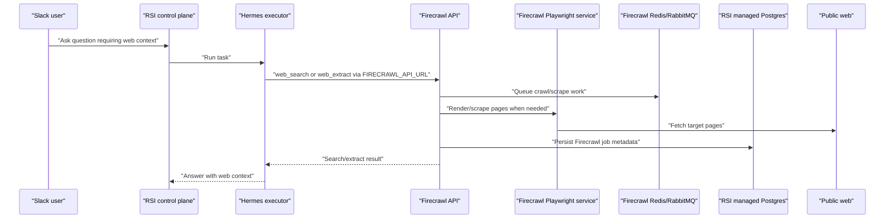

# Firecrawl Web Search Architecture

RSI/Hermes web search is backed by a self-hosted Firecrawl deployment in the
stage Kubernetes cluster. Hermes does not receive a Firecrawl cloud API key.
It receives only `FIRECRAWL_API_URL`, and the pinned Hermes fork uses that URL
as the backend for native `web_search` and `web_extract`.

## Runtime Boundary

- `story-deployments` owns the Kubernetes runtime shape.
- Firecrawl services are internal `ClusterIP` services in `rsi-platform`; no
  ingress is created.
- Hermes is configured with
  `FIRECRAWL_API_URL=http://use1-stage-rsi-agent-platform-firecrawl-api:3002`.
- No `FIRECRAWL_API_KEY` is configured for self-hosted usage.
- Firecrawl images are mirrored into stage ECR before deployment so pods do not
  depend on public GHCR or Docker Hub pulls at runtime.

## Data Stores

Firecrawl uses the existing RSI managed Postgres instance, but with its own
database and user:

- database: `firecrawl`
- user: `firecrawl`
- host: RSI stage RDS endpoint
- secret source: `secret/use1-stage/rsi-agent-platform`

Firecrawl should not use the RSI control-plane application database/user. It
owns its own application tables inside the `firecrawl` database. This means RSI
does not add Go/Postgres migrations for Firecrawl; Firecrawl's service startup
is responsible for its own datastore initialization.

Redis is intentionally dedicated to Firecrawl. Honcho already uses Redis for
RSI memory workflows, and sharing that Redis would couple crawl queues/cache to
Hermes memory behavior and failure modes.

## Vault Contract

The stage deployment expects these Vault keys under
`secret/use1-stage/rsi-agent-platform`:

- `FIRECRAWL_POSTGRES_HOST`
- `FIRECRAWL_POSTGRES_PORT`
- `FIRECRAWL_POSTGRES_DB`
- `FIRECRAWL_POSTGRES_USER`
- `FIRECRAWL_POSTGRES_PASSWORD`
- `FIRECRAWL_BULL_AUTH_KEY`

These are consumed by the Firecrawl pods only. Hermes receives only
`FIRECRAWL_API_URL`.

## Launch Checks

1. Confirm Firecrawl ECR repos/images exist in the stage account.
2. Confirm the `firecrawl` database and user exist on the RSI stage RDS.
3. Confirm Vault contains the Firecrawl keys above.
4. Sync `use1-stage-rsi-agent-platform` in Argo CD.
5. Wait for these deployments:
   - `use1-stage-rsi-agent-platform-firecrawl-api`
   - `use1-stage-rsi-agent-platform-firecrawl-playwright`
   - `use1-stage-rsi-agent-platform-firecrawl-redis`
   - `use1-stage-rsi-agent-platform-firecrawl-rabbitmq`
6. Restart or roll Hermes executor so its config includes `FIRECRAWL_API_URL`.
7. Smoke test `/v1/scrape` from inside the cluster.
8. Ask RSI for a current web lookup and verify Hermes uses native
   `web_search`/`web_extract`.
